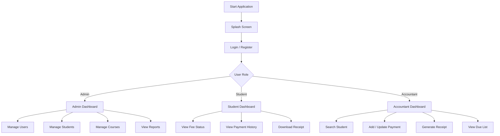
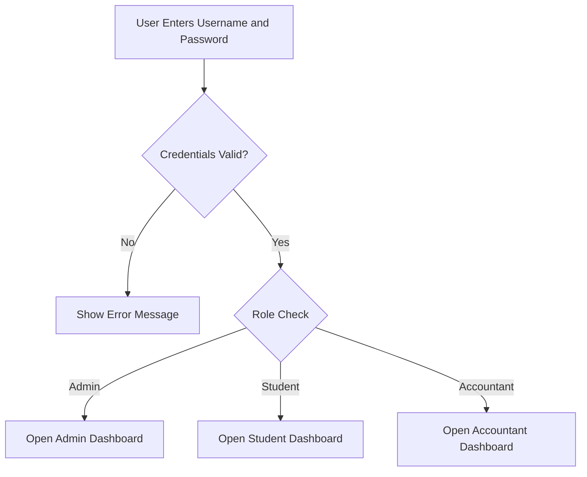
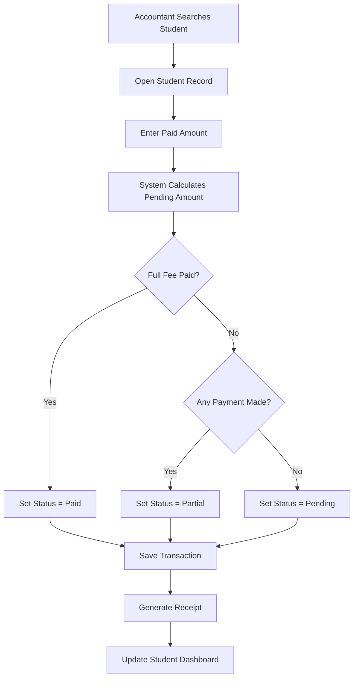
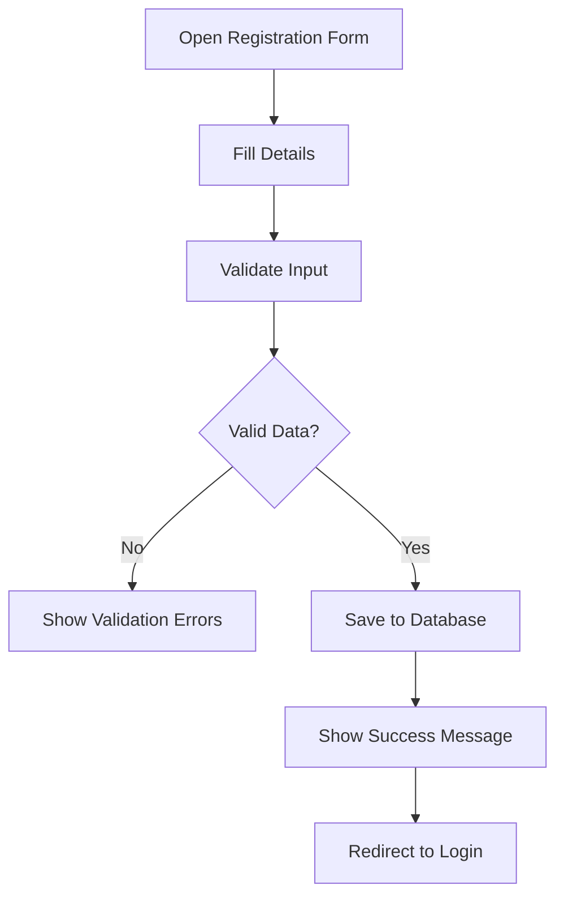
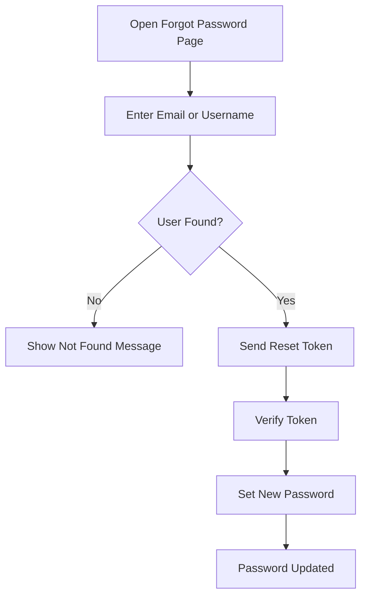

# Fee Status Management System

## Flow Diagram and UI Design Blueprint

This document shows how the system should work and how the UI should look for a professional GUI-based Python and MySQL project.

---

## 1. Overall System Flow



---

## 2. Login to Dashboard Flow



---

## 3. Fee Payment Flow



---

## 4. User Registration Flow



---

## 5. Forgot Password Flow



---

## 6. Recommended UI Layout

### A. Login Screen

```
-----------------------------------------------------------
|  BRAND PANEL            |        LOGIN PANEL            |
|-------------------------|--------------------------------|
|  Logo                   |  Username / Email              |
|  Project Name           |  Password                      |
|  Tagline                |  Role Select / Auto Detect    |
|  Illustration           |  [Login Button]                |
|                         |  Forgot Password               |
|                         |  Register                      |
-----------------------------------------------------------
```

### UI Style for Login
- Left side should carry branding
- Right side should contain the form
- Use a clean card with soft shadow
- Add subtle gradient or glass effect
- Keep the form centered and spacious

---

### B. Dashboard Screen

```
-----------------------------------------------------------------------------------
| Top Bar: Logo | Search | Notifications | Profile | Logout                        |
-----------------------------------------------------------------------------------
| Sidebar       |  Stat Card 1   | Stat Card 2   | Stat Card 3   | Stat Card 4    |
| - Dashboard   |------------------------------------------------------------------|
| - Students    |  Recent Table / Chart Area                                         |
| - Fees        |                                                                   |
| - Reports     |  Quick Actions / Alerts / Due List                                |
| - Settings    |                                                                   |
-----------------------------------------------------------------------------------
```

### UI Style for Dashboard
- Fixed sidebar on the left
- Top navigation bar with profile and logout
- Main content area with cards and tables
- Use charts for total collection and pending dues
- Keep spacing open and balanced

---

### C. Student Fee View Screen

```
-----------------------------------------------------------
| Student Profile Card                                    |
|---------------------------------------------------------|
| Name:            | Course:                              |
| Admission No:     | Total Fee:                           |
| Paid Amount:      | Pending Amount:                      |
| Fee Status:       | Last Payment Date:                   |
-----------------------------------------------------------
| Payment History Table                                   |
| Receipt Download Button                                 |
-----------------------------------------------------------
```

### UI Style for Student Screen
- Simple and clean
- Use status badges for `Paid`, `Partial`, `Pending`
- Show readable tables
- Keep actions minimal and clear

---

### D. Accountant Screen

```
-----------------------------------------------------------
| Search Student                                           |
|---------------------------------------------------------|
| Search by ID / Name / Mobile                             |
| [Search Button]                                          |
-----------------------------------------------------------
| Student Details | Fee Entry Form | Payment Summary       |
|---------------------------------------------------------|
| Payment History Table                                    |
| [Save Payment] [Generate Receipt]                        |
-----------------------------------------------------------
```

### UI Style for Accountant Screen
- Search box at top
- Student info on the left
- Payment form on the right
- History table below
- Action buttons should be clearly visible

---

## 7. Visual Style Direction

The interface should look like a real SaaS/admin product:

- Use a navy, blue, teal, or charcoal base
- Keep background light or softly textured
- Use white cards with subtle shadows
- Use rounded corners
- Use smooth hover effects
- Use consistent SVG icons
- Use modern typography
- Avoid clutter
- Maintain strong spacing and alignment

---

## 8. Screen Priority Order

Build the UI in this order:

1. Splash screen
2. Login screen
3. Registration screen
4. Forgot password screen
5. Admin dashboard
6. Accountant dashboard
7. Student dashboard
8. Student management screen
9. Fee entry screen
10. Reports screen
11. Settings screen

---

## 9. Recommended Components

Reusable components should include:

- Sidebar
- Navbar
- Stat card
- Table component
- Form input
- Dropdown
- Button
- Modal
- Toast notification
- Status badge
- Receipt card

---

## 10. Final Visual Summary

The application should feel like:

- a premium school ERP system
- a professional fee management dashboard
- a clean commercial software product
- not a simple student project

The design should be modern, structured, and easy to use for staff and students.

